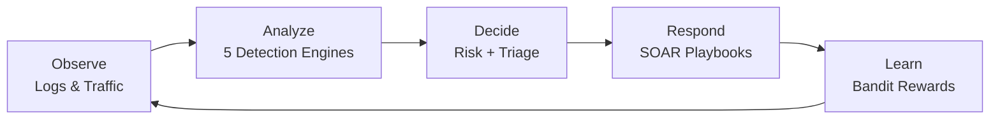
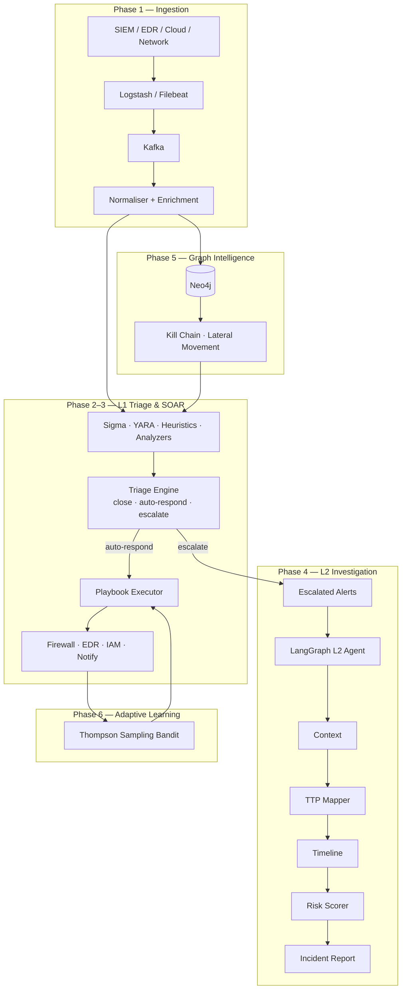
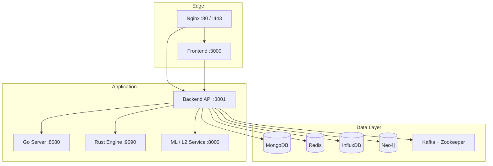
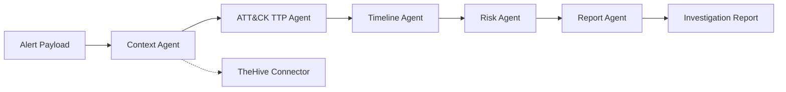
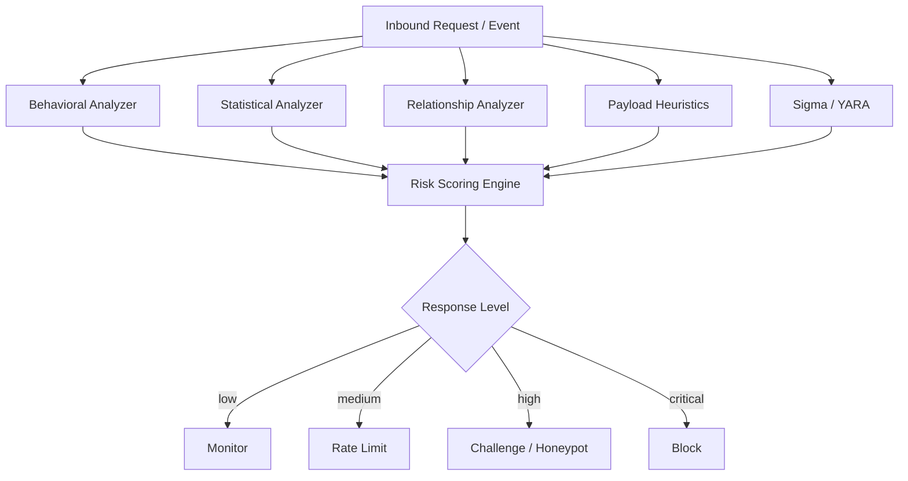

# PHANTOM-Flow: Smart Adaptive Defense & SOC Automation Platform

## Overview

PHANTOM-Flow is a next-generation cybersecurity platform that combines **multi-perspective threat detection**, **SOC L1/L2 automation**, and **closed-loop learning** into a single defense engine. It ingests logs from SIEM/EDR/cloud sources, triages alerts automatically, executes SOAR playbooks, runs L2 investigations via an agent graph, and continuously improves response decisions with multi-armed bandit learning.

Instead of relying on a single detection method, PHANTOM-Flow fuses **statistics**, **behavioral patterns**, **relationship graphs**, **payload heuristics**, and **deception** into one pipeline. Every response feeds back into learning so the system gets better at separating real customers from attackers.

---

## Table of Contents

- [Architecture Diagrams](#architecture-diagrams)
- [Default Login Credentials](#default-login-credentials)
- [Quick Start](#quick-start)
- [Project Structure](#project-structure)
- [SOC Automation Phases](#soc-automation-phases)
- [API Endpoints](#api-endpoints)
- [Technology Stack](#technology-stack)
- [Configuration](#configuration)
- [Troubleshooting](#troubleshooting)
- [Contributing & License](#contributing--license)

---

## Architecture Diagrams

### Closed-loop defense cycle



### End-to-end SOC automation pipeline



### Runtime deployment (Docker Compose)



### L2 investigation agent graph



### Detection engine fusion



---

## Default Login Credentials

> **Development only.** Change all passwords before production deployment.

### SOC Dashboard (web UI)

| Service | URL | Username | Password | Notes |
|---------|-----|----------|----------|-------|
| **PHANTOM-Flow Dashboard** | http://localhost:3000 | `soc-analyst` | `PhantomFlow@2025` | Recommended demo SOC analyst account |
| **PHANTOM-Flow Dashboard** | http://localhost:3000 | `admin` | `admin` | Alternate demo account |

The dashboard uses **mock authentication** in development: `POST /api/auth/login` accepts any username/password and returns an admin JWT. The credentials above are the **canonical demo pair** for SOC analyst walkthroughs.

```bash
# Verify login via API
curl -X POST http://localhost:3001/api/auth/login \
  -H "Content-Type: application/json" \
  -d '{"username":"soc-analyst","password":"PhantomFlow@2025"}'
```

### Infrastructure services (Docker Compose defaults)

| Service | URL | Username | Password / Token |
|---------|-----|----------|-------------------|
| **Neo4j Browser** | http://localhost:7474 | `neo4j` | `dev-password-123` |
| **MongoDB** | `mongodb://localhost:27017` | `admin` | `dev-password-456` |
| **InfluxDB** | http://localhost:8086 | `admin` | `dev-password-456` |
| **InfluxDB API token** | — | — | `dev-token-789` |

Override via environment variables in `.env` or `docker-compose.yml`: `NEO4J_PASSWORD`, `MONGO_USER`, `MONGO_PASSWORD`, `INFLUXDB_USER`, `INFLUXDB_PASSWORD`, `INFLUXDB_TOKEN`.

### Deception / honeypot traps (not dashboard login)

These credentials are **intentionally fake** — they trigger deception traps when attackers use them:

| Credential trap | Purpose |
|----------------|---------|
| `admin:admin123` | Fake admin login trap |
| `root:password` | Fake root credential trap |
| `test:test123` | Fake test account trap |

---

## Quick Start

### Prerequisites

| Requirement | Version | Required |
|-------------|---------|----------|
| Node.js | 18+ | Yes |
| npm | 9+ | Yes |
| Docker & Docker Compose | Latest | Optional (full stack) |
| Python | 3.10+ | Optional (L2 agent) |
| Go | 1.22+ | Optional |
| Rust | stable | Optional |

### Option A — Local development (Node only)

```bash
git clone <repository-url>
cd phontomflow

# Backend
cd backend
cp env.example .env
npm install
npm run dev          # http://localhost:3001

# Frontend (new terminal)
cd ../frontend
npm install
npm run dev          # http://localhost:3000
```

Sign in at http://localhost:3000 with **`soc-analyst` / `PhantomFlow@2025`**.

### Option B — Full stack with Docker

```bash
git clone <repository-url>
cd phontomflow
docker compose up -d
```

| Service | URL |
|---------|-----|
| Dashboard | http://localhost:3000 |
| Backend API | http://localhost:3001 |
| API docs | http://localhost:3001/api/docs |
| Neo4j Browser | http://localhost:7474 |
| Health check | http://localhost:3001/health |

### Option C — L2 investigation agent (standalone)

```bash
cd services/l2-agent
pip install fastapi uvicorn httpx
uvicorn main:app --host 0.0.0.0 --port 8000

# Trigger via backend proxy
curl -X POST http://localhost:3001/api/l2/investigate \
  -H "Content-Type: application/json" \
  -d '{"alert_id":"demo-001","severity":"high","src_ip":"203.0.113.10"}'
```

### Run tests

```bash
# Backend bandit learning tests
cd backend && npm test

# L2 agent tests
pytest tests/l2_agent_test.py
```

---

## Project Structure

```
phontomflow/
├── backend/
│   ├── src/                    # Runtime TypeScript server
│   │   ├── core/               # Detection engines, EWMA, Markov, bandit
│   │   ├── api/routes/         # REST routes (auth, threats, playbooks, l2, graph)
│   │   └── services/           # Redis, deception, metrics, integrations
│   ├── ingestion/              # Phase 1 — Kafka, normaliser, enrichment
│   ├── detection/              # Phase 2 — Sigma, YARA, TTP mapper, heuristics
│   ├── triage/                 # Phase 2 — Decision engine, whitelist
│   ├── soar/                   # Phase 3 — Playbooks, executor, actions
│   ├── bandit/                 # Phase 6 — Thompson sampling, MAB rewards
│   ├── graph/                  # Phase 5 — Kill chain, lateral movement
│   └── db/                     # Neo4j client & schema
├── frontend/                   # React + Vite SOC dashboard
├── services/l2-agent/          # Phase 4 — Python L2 investigation service
├── tests/                      # Integration & E2E tests
├── .github/workflows/          # CI/CD pipelines
├── docker-compose.yml          # Full stack orchestration
├── claude.md                   # SOC build plan (Phases 1–6, T1–T48)
└── ai.md                       # Implementation status tracker
```

---

## SOC Automation Phases

| Phase | Goal | Key paths |
|-------|------|-----------|
| **1** | Unified log ingestion & enrichment | `backend/ingestion/` |
| **2** | L1 alert triage & noise reduction | `backend/detection/`, `backend/triage/` |
| **3** | SOAR playbook execution | `backend/soar/playbooks/` |
| **4** | L2 autonomous investigation | `services/l2-agent/` |
| **5** | Neo4j graph threat intelligence | `backend/graph/`, `backend/db/` |
| **6** | Bandit-based response learning | `backend/bandit/` |

Built-in SOAR playbooks:

- `brute_force_response`
- `port_scan_response`
- `malware_hash_block`
- `data_exfil_response`
- `honeypot_trigger_response`

Trigger example:

```bash
curl -X POST http://localhost:3001/api/playbooks/brute_force_response/trigger \
  -H "Content-Type: application/json" \
  -d '{"src_ip":"198.51.100.42","severity":"high"}'
```

---

## API Endpoints

### Authentication

| Method | Endpoint | Description |
|--------|----------|-------------|
| `POST` | `/api/auth/login` | User login |
| `POST` | `/api/auth/logout` | Session logout |
| `GET` | `/api/auth/verify` | Token validation |
| `GET` | `/api/auth/profile` | User profile |

### Threats & Dashboard

| Method | Endpoint | Description |
|--------|----------|-------------|
| `GET` | `/api/threats` | List threats |
| `GET` | `/api/dashboard/overview` | System overview |
| `GET` | `/api/dashboard/analytics` | Analytics data |
| `GET` | `/api/metrics/real-time` | Live metrics |

### SOC automation

| Method | Endpoint | Description |
|--------|----------|-------------|
| `POST` | `/api/playbooks/:id/trigger` | Execute SOAR playbook |
| `GET` | `/api/playbooks` | List playbooks |
| `POST` | `/api/l2/investigate` | Proxy to L2 agent |
| `GET` | `/api/graph/*` | Neo4j graph queries |
| `GET` | `/api/bandit/*` | Bandit learning metrics |

### Deception & Health

| Method | Endpoint | Description |
|--------|----------|-------------|
| `GET` | `/api/deception/events` | Honeypot events |
| `POST` | `/api/deception/trigger` | Manual trap trigger |
| `GET` | `/health` | Server health |

Full interactive docs: **http://localhost:3001/api/docs**

---

## Technology Stack

| Layer | Technologies |
|-------|-------------|
| **Core API** | Node.js, Express, TypeScript |
| **Frontend** | React, Vite, Tailwind CSS, Recharts |
| **ML / L2** | Python, FastAPI, LangGraph-style agents |
| **Data** | MongoDB, Redis, InfluxDB, Neo4j, Kafka |
| **High-perf** | Go microservices, Rust security engine |
| **Security** | JWT, bcrypt, Helmet, rate limiting, deception layer |

---

## Configuration

Copy `backend/env.example` to `backend/.env`:

```env
NODE_ENV=development
PORT=3001
MONGODB_URI=mongodb://localhost:27017/phantom-flow
REDIS_URL=redis://localhost:6379
JWT_SECRET=your-super-secret-jwt-key-change-in-production
NEO4J_URI=bolt://localhost:7687
NEO4J_USER=neo4j
NEO4J_PASSWORD=dev-password-123
KAFKA_BROKERS=localhost:9092
L2_AGENT_URL=http://127.0.0.1:8000
HONEYPOT_ENABLED=true
```

Frontend (`frontend/.env`):

```env
VITE_API_URL=http://localhost:3001
```

---

## Troubleshooting

| Issue | Fix |
|-------|-----|
| Backend won't start | Check `.env`, Redis/Mongo availability; backend continues if Kafka is down |
| Login fails | Ensure backend is on `:3001`; mock auth accepts any credentials in dev |
| Playbook not found | Run backend from `backend/` cwd or ensure `soar/playbooks/` is reachable |
| L2 investigate fails | Start L2 agent on port 8000; set `L2_AGENT_URL` |
| `tsc` errors | Run `npx tsc --noEmit` in `backend/` |
| Docker build fails | Ensure Docker daemon is running |

Logs: `backend/logs/combined.log`, `backend/logs/error.log`

---

## Contributing & License

1. Fork the repository
2. Create a feature branch
3. Add tests for new functionality
4. Submit a pull request

**License:** MIT — see [LICENSE](LICENSE)

**Security issues:** email security@phantom-flow.com (do not open public issues)

---

**PHANTOM-Flow** — turning cybersecurity from reactive catch-up into proactive, intelligence-driven defense.

*Multi-language platform: TypeScript core · Python L2/ML · Go services · Rust engine · React SOC dashboard*
