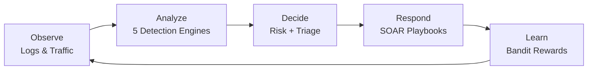
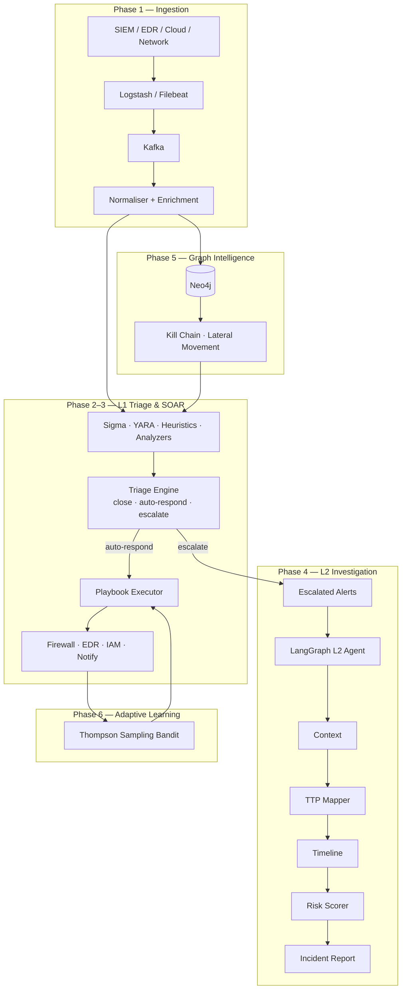
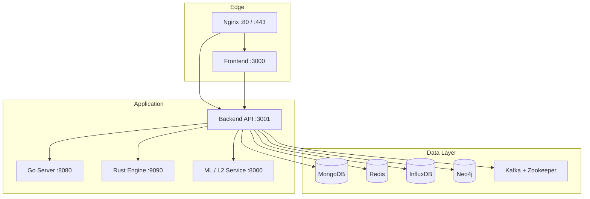
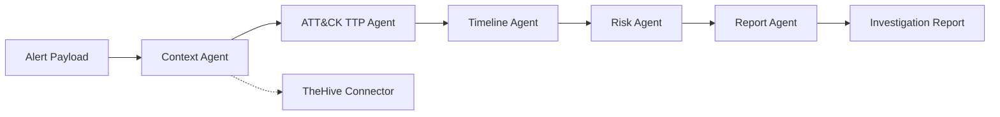
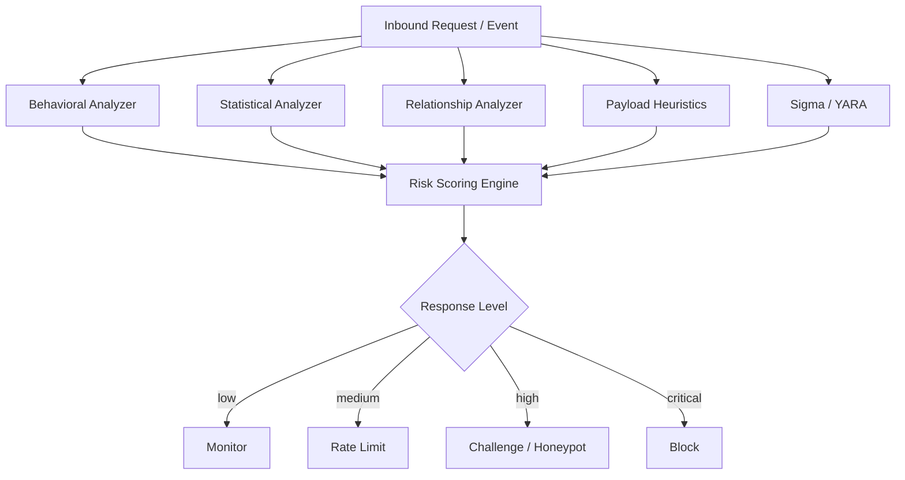

# PHANTOM-Flow: Smart Adaptive Defense & SOC Automation Platform

[](https://opensource.org/licenses/MIT)
[](#)
[](#)
[](#)
[](#)
[](#)

PHANTOM-Flow is an enterprise-grade, multi-language cybersecurity platform that integrates **multi-perspective threat detection**, **SOC L1/L2 automation**, **graph-based threat intelligence**, and **closed-loop feedback learning** into a single cohesive defense engine. 

By fusing statistics, behavioral sequences, relationship topologies, payload heuristics, and active deception, PHANTOM-Flow protects modern web infrastructures while dynamically minimizing false positives via contextual reinforcement learning.

---

## Table of Contents

- [Architecture Diagrams](#architecture-diagrams)
- [System Capabilities & Algorithmic Core](#system-capabilities--algorithmic-core)
- [Specialized Security Modules (Python)](#specialized-security-modules-python)
- [Go & Rust Security Engines](#go--rust-security-engines)
- [Project Structure](#project-structure)
- [SOC Automation & Playbooks](#soc-automation--playbooks)
- [Default Login Credentials](#default-login-credentials)
- [API Reference](#api-reference)
- [Configuration Guide](#configuration-guide)
- [Quick Start & Running Guide](#quick-start--running-guide)
- [Troubleshooting](#troubleshooting)
- [Contributing & License](#contributing--license)

---

## Architecture Diagrams

### Closed-Loop Defense Cycle


### End-to-End SOC Automation Pipeline


### Runtime Deployment (Docker Compose)


### L2 Investigation Agent Graph


### Detection Engine Fusion


---

## System Capabilities & Algorithmic Core

PHANTOM-Flow integrates several advanced data structures and machine learning algorithms directly into its stream-processing core to perform near-zero latency threat detection and adaptive responses:

| Algorithm / Component | Purpose | Target / Implementation Path |
|---|---|---|
| **Count-Min Sketch** | Memory-efficient cardinality and sub-second frequency estimation for rate/error spikes. | `backend/src/core/sketch/` (Redis backed) |
| **HyperLogLog (HLL)** | Cardinality estimation for tracking unique visitor metrics, IP counts, and geo-spikes. | `backend/src/core/hyperloglog/` (Redis backed) |
| **Markov Chain Sequences** | N-order behavioral state flow sequence modeling to detect anomalous navigation paths. | `backend/src/core/markov/` (Redis backed) |
| **Advanced EWMA** | Multi-window Exponentially Weighted Moving Average for baseline tracking & concept drift detection. | `backend/src/core/ewma/` |
| **Adaptive Rate Limiting** | Dynamic policy engine backing token-bucket & sliding-window rate limiters based on risk scores. | `backend/src/core/rateLimit/` |
| **Thompson Sampling MAB** | Multi-Armed Bandit framework selecting defense actions (Allow, Block, Challenge) based on feedback rewards. | `backend/src/core/bandit/` |
| **TensorFlow.js (AI Core)** | Real-time neural network threat scoring model integrated into the TypeScript backend. | `backend/src/core/ThreatDetectionEngine.ts` |

---

## Specialized Security Modules (Python)

PHANTOM-Flow features dedicated Python security modules that enable advanced analysis, post-quantum compliance, and penetration testing simulations:

### 1. Post-Quantum Cryptography & Threat Simulator (`quantum_security/`)
- **Quantum Attack Simulation**: Assesses the threat levels of classic cryptographic suites against Shor's and Grover's algorithms.
- **Key Generation**: Simulates post-quantum public-key exchange and signatures (Lattice-based KEM like CRYSTALS-Kyber, Code-based Classic McEliece, Multivariate, Hash-based signatures, and Isogeny-based keys).
- **Location**: `quantum_security/quantum_cryptography.py`

### 2. DeFi & Smart Contract Security Auditor (`blockchain_security/`)
- **Static Analysis**: Detects critical Solidity vulnerability patterns, including Reentrancy, Integer Overflow/Underflow, Access Control failures, Weak Randomness, and Timestamp dependency.
- **DeFi Guardrails**: Inspects flash loan integrations, Oracle manipulation vectors (e.g. price feeds, lack of TWAP validation), and governance delay (timelock) validations.
- **Gas Auditing**: Analyzes gas-inefficient patterns and estimates savings (e.g. loop length caching, memory vs storage optimization).
- **Location**: `blockchain_security/smart_contract_auditor.py`

### 3. Penetration Testing Framework (`security_tools/`)
- **Port Scanner**: Multithreaded TCP SYN and UDP port scanner utilizing raw sockets and Nmap bindings.
- **Service Enumeration**: Identifies target banners, version detection, anonymous FTP checks, and weak SSH cipher analysis.
- **Web Vuln Scanner**: Automated scans for SQL Injection (SQLi), Cross-Site Scripting (XSS), Command Injection (CMDi), SSL/TLS vulnerabilities, and directory enumeration.
- **Location**: `security_tools/penetration_testing.py`

---

## Go & Rust Security Engines

For performance-critical processing, PHANTOM-Flow offloads compute-heavy tasks to Go and Rust subsystems:

### Rust Security Engine (`src/` / `Cargo.toml`)
- **Role**: High-performance packet capture and security filtering layer.
- **Capabilities**:
  - Raw packet sniffing utilizing `pcap` / `pnet`.
  - gRPC service using `tonic` / `prost` to communicate with the Node.js orchestrator.
  - Native machine learning inferences utilizing `candle-core` (Rust-native tensor framework) and PyTorch (`tch-rs`).
  - Kafka consumer/producer bindings using `rdkafka`.
- **Location**: Rust files are situated in the root directory (`src/`, `Cargo.toml`, `build.rs`).

### Go Microservices (`cmd/` / `go.mod`)
- **Role**: Concurrent log aggregation and high-speed scanner agents.
- **Sub-Services**:
  - `security-server` (`cmd/security-server/`): A high-concurrency event gateway implementing gRPC and WebSocket APIs, persistent configuration caching, and Kafka log producer routing.
  - `log-analyzer` (`cmd/log-analyzer/`): High-speed regex parser engine that reads raw system/web logs and transforms them into normalized Kafka alerts.
  - `threat-scanner` (`cmd/threat-scanner/`): Rapid IP/CIDR threat intelligence reputation checker.
- **Location**: Go services reside in `cmd/`, common code in `internal/`, and module definitions in `go.mod` / `go.sum`.

---

## Project Structure

```
phontomflow/
├── backend/                         # Node.js/TypeScript Core REST API & Triage orchestrator
│   ├── src/
│   │   ├── core/                    # ThreatDetectionEngine, EWMA, Markov, HLL, Count-Min, MAB
│   │   ├── api/routes/              # Express REST endpoints
│   │   └── services/                # Redis, Deception, Metrics, Socket.IO
│   ├── ingestion/                   # Ingestion pipeline, Kafka consumer, normalizer, enrichers
│   ├── detection/                   # Sigma parser, YARA rules, Payload Heuristics
│   ├── triage/                      # Whitelist suppression, decisionEngine (close/auto-respond/escalate)
│   ├── soar/                        # Playbook schema, executor, and actions (firewall, EDR, IAM, notify)
│   ├── db/                          # Neo4j and MongoDB driver connections
│   ├── graph/                       # Kill chain and lateral movement Cypher queries
│   └── bandit/                      # Thompson sampling MAB framework
├── frontend/                        # React + Vite + Tailwind CSS SOC Dashboard
│   ├── src/
│   │   ├── pages/                   # Analytics, Dashboard, Deception, Graph, Setup, Threats
│   │   ├── components/              # Layout, Graph visuals, auth context, bandit performance
│   │   └── services/                # API client connection services
├── services/l2-agent/               # Python LangGraph L2 Investigation Microservice
├── ml_service/                      # Python FastAPI TensorFlow ML Classification Service
├── quantum_security/                # Post-Quantum Cryptography & Quantum Threat Simulation Module
├── blockchain_security/             # DeFi & Solidity Smart Contract Auditing Platform
├── security_tools/                  # Network & Web Application Penetration Testing Framework
├── k8s/                             # Kubernetes deployment manifests
├── docker-compose.yml               # Full stack orchestration compose file
├── Cargo.toml                       # Rust workspace and dependency configuration
├── go.mod                           # Go workspace and module definition
├── package.json                     # Root NPM workspace definitions
└── claude.md                        # SOC build plan (Phases 1–6, T1–T48)
```

---

## SOC Automation & Playbooks

PHANTOM-Flow operates a graduated triage and defense flow:
1. **L1 Triage**: Incoming normalized logs are analyzed by the 5 detection engines. The `decisionEngine.ts` decides whether to **Close** the alert (false positive), **Auto-Respond** (executes SOAR playbooks), or **Escalate** (sends to Python L2 agent).
2. **SOAR Playbooks**: When playbooks trigger, the `executor.ts` runs ordered JSON recipes:
   - `port_scan_response`: Escalates rate limits and adds temporary firewall blocks.
   - `brute_force_response`: Forces credential lockouts and resets accounts.
   - `data_exfil_response`: Isolates affected hosts using EDR quarantines.
   - `malware_hash_block`: Updates host and network blacklists.
   - `honeypot_trigger_response`: Diverts attacker sessions to decoy traps.

---

## Default Login Credentials

> [!WARNING]
> **Development configuration only.** Change all passwords before deploying to a public network.

### SOC Web Dashboard
- **URL**: `http://localhost:3000`
- **Analyst Login**: `soc-analyst` / `PhantomFlow@2025`
- **Admin Login**: `admin` / `admin`

### Database & Message Queue defaults
- **Neo4j Browser**: `http://localhost:7474` (`neo4j` / `dev-password-123`)
- **MongoDB**: `mongodb://localhost:27017` (`admin` / `dev-password-456`)
- **InfluxDB**: `http://localhost:8086` (`admin` / `dev-password-456`, token: `dev-token-789`)
- **Kafka**: `localhost:9092`

---

## API Reference

### Authentication
- `POST /api/auth/login` - User authentication and JWT distribution.
- `GET /api/auth/verify` - Token validation and routing auth.

### Threats & Dashboard
- `GET /api/threats` - Retrieves threat logs and ongoing alerts.
- `GET /api/dashboard/overview` - Fetches live risk score, active threats, and honeypot events.
- `GET /api/dashboard/analytics` - Pulls historical time-series analytics.

### Triage & SOAR
- `POST /api/playbooks/:id/trigger` - Manually executes a SOAR playbook.
- `POST /api/l2/investigate` - Forwards threat payloads to the Python LangGraph L2 agent.
- `GET /api/graph/killchain` - Cypher queries to extract graph-based threat topologies from Neo4j.

---

## Configuration Guide

Configure each subsystem by copying environment files:

### Backend Configuration (`backend/.env`)
```env
NODE_ENV=development
PORT=3001
MONGODB_URI=mongodb://localhost:27017/phantom-flow
REDIS_URL=redis://localhost:6379
JWT_SECRET=your-super-secret-jwt-key-change-in-production
NEO4J_URI=bolt://localhost:7687
NEO4J_USER=neo4j
NEO4J_PASSWORD=dev-password-123
KAFKA_BROKERS=localhost:9092
L2_AGENT_URL=http://127.0.0.1:8000
HONEYPOT_ENABLED=true
```

### Frontend Configuration (`frontend/.env`)
```env
VITE_API_URL=http://localhost:3001
```

---

## Quick Start & Running Guide

### Option A — Full Stack Deploy (Docker Compose)
To launch all services, databases, and message queues:
```bash
docker compose up -d
```

### Option B — Run Services Separately (Local Dev)

#### 1. Core Web Stack (Node & React)
```bash
# Start Backend Orchestrator
cd backend
npm install
npm run dev # Launches API server on port 3001

# Start React Frontend (in a new shell)
cd ../frontend
npm install
npm run dev # Launches Web UI on port 3000
```

#### 2. LangGraph L2 Agent (Python)
Ensure Python 3.10+ is installed:
```bash
cd services/l2-agent
pip install fastapi uvicorn httpx langgraph langchain-openai
uvicorn main:app --host 0.0.0.0 --port 8000
```

#### 3. Python ML Inference Service (`ml_service`)
```bash
cd ml_service
pip install -r requirements.txt
python run.py # Launches FastAPI on port 8000 (configurable via PORT env)
```

#### 4. Rust Security Engine (`src/`)
Requires Rust and Cargo installed:
```bash
# Build and run the security engine with all features enabled
cargo run --features "full"
```

#### 5. Go Microservices (`cmd/`)
Requires Go 1.25 installed:
```bash
# Run the main security and WebSocket gateway server
go run cmd/security-server/main.go cmd/security-server/kafka.go cmd/security-server/grpc.go

# Run the high-speed log aggregation/analysis client
go run cmd/log-analyzer/main.go

# Run the reputation threat intelligence scanner
go run cmd/threat-scanner/main.go
```

#### 6. Specialized Python Tools
To test or execute the standalone auditing and scanning tools:
```bash
# Run Post-Quantum Cryptography & Threat assessment simulator
python quantum_security/quantum_cryptography.py

# Run DeFi Smart Contract Solidity Auditor
python blockchain_security/smart_contract_auditor.py

# Run Pentest and Vulnerability scanner
python security_tools/penetration_testing.py
```

---

## Troubleshooting

- **gRPC connection errors**: Ensure the Go Server (`:8080`) or Rust Engine (`:9090`) are listening, and check that firewall ports are configured properly.
- **Neo4j connection errors**: Verify Neo4j status by accessing `http://localhost:7474`. Make sure bolt authentication matches your `NEO4J_PASSWORD` in `backend/.env`.
- **Kafka connection drops**: The Node.js and Go microservices will continue running if Kafka is temporarily unreachable. Verify docker containers are active: `docker compose ps`.

---

## Contributing & License

1. Fork the repository.
2. Develop features in a separate branch.
3. Validate and run test suites:
   ```bash
   cd backend && npm test
   pytest tests/
   ```
4. Open a pull request.

**License**: MIT — see [LICENSE](LICENSE)

**Security issues**: Email security@phantom-flow.com (please do not open public GitHub issues).

---

**PHANTOM-Flow** — Turning reactive cybersecurity into dynamic, intelligence-driven, automated defense.
