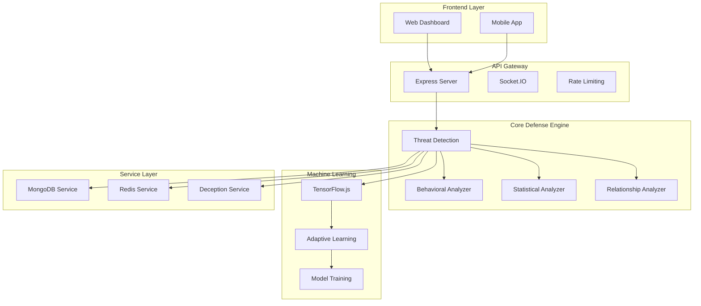

# 🛡️ PHANTOM-Flow Defense System

<div align="center">


**Next-Generation Cybersecurity Platform**  
*Combining Machine Learning, Behavioral Analysis & Deception Technology*

[](https://nodejs.org/)
[](https://www.typescriptlang.org/)
[](LICENSE)
[]()

[🚀 Quick Start](#-quick-start) • [🏗️ Architecture](#️-architecture) • [🔌 API Reference](#-api-reference) • [🛠️ Development](#️-development)

</div>

---

## 🌟 Overview

**PHANTOM-Flow** is a sophisticated cybersecurity platform that provides real-time threat detection, behavioral analysis, and adaptive machine learning capabilities. Built with modern technologies, it offers enterprise-grade security for web applications.

### ✨ Key Features

<table>
<tr>
<td width="50%">

🔍 **Multi-Perspective Analysis**
- Behavioral pattern recognition
- Statistical anomaly detection  
- Network relationship mapping
- Real-time threat scoring

🤖 **Machine Learning Engine**
- TensorFlow.js integration
- Adaptive learning algorithms
- Continuous model improvement
- Advanced pattern recognition

</td>
<td width="50%">

🎭 **Deception Technology**
- Intelligent honeypot systems
- Credential trap mechanisms
- Decoy environment creation
- Attack pattern analysis

⚡ **Real-Time Processing**
- Sub-second threat evaluation
- Live security alerts
- WebSocket communication
- Instant response capabilities

</td>
</tr>
</table>

---

## 🚀 Quick Start

### 📋 Prerequisites

- **Node.js** 18.0.0 or higher
- **npm** or **yarn** package manager
- **Git** for version control

### ⚡ Installation

```bash
# 1. Clone the repository
git clone <repository-url>
cd phantom-flow/backend

# 2. Install dependencies
npm install

# 3. Set up environment variables
cp env.example .env
# Edit .env with your configuration

# 4. Start development server
npm run dev
```

### 🎯 Access Points

| Service | URL | Description |
|---------|-----|-------------|
| **Health Check** | http://localhost:3001/health | Server status & version |
| **Dashboard** | http://localhost:3001/api/dashboard/overview | Main dashboard interface |
| **API Base** | http://localhost:3001/api | All API endpoints |

---

## 🏗️ Architecture

<div align="center">



</div>

### 🏛️ Project Structure

```
backend/
├── 📁 src/
│   ├── 📁 api/routes/          # REST API endpoints
│   │   ├── 🔐 auth.ts         # Authentication routes
│   │   ├── 🛡️ threats.ts      # Threat management
│   │   ├── 📊 dashboard.ts     # Dashboard data
│   │   ├── 🎭 deception.ts     # Deception layer
│   │   └── 📈 metrics.ts       # System metrics
│   ├── 📁 core/               # Core defense engine
│   │   ├── 🚨 ThreatDetectionEngine.ts
│   │   ├── 👤 BehavioralAnalyzer.ts
│   │   ├── 📊 StatisticalAnalyzer.ts
│   │   └── 🔗 RelationshipAnalyzer.ts
│   ├── 📁 services/           # Business logic
│   │   ├── 🗄️ DatabaseService.ts
│   │   ├── ⚡ RedisService.ts
│   │   ├── 🎭 DeceptionService.ts
│   │   └── 🧠 AdaptiveLearningService.ts
│   ├── 📁 models/             # Data models
│   ├── 📁 types/              # TypeScript definitions
│   ├── 📁 utils/              # Utility functions
│   └── 🚀 index.ts            # Application entry point
├── 📁 logs/                   # Application logs
├── 📁 dist/                   # Compiled JavaScript
├── 📄 package.json            # Dependencies & scripts
├── 📄 tsconfig.json           # TypeScript config
├── 📄 nodemon.json            # Development config
└── 📄 env.example             # Environment template
```

---

## 🔌 API Reference

### 🔐 Authentication Endpoints

| Method | Endpoint | Description | Status |
|--------|----------|-------------|--------|
| `POST` | `/api/auth/login` | User authentication | ✅ Active |
| `POST` | `/api/auth/logout` | Session termination | ✅ Active |
| `GET` | `/api/auth/verify` | Token validation | ✅ Active |

### 🛡️ Threat Management

| Method | Endpoint | Description | Status |
|--------|----------|-------------|--------|
| `GET` | `/api/threats` | List all threats | ✅ Active |
| `GET` | `/api/threats/:id` | Get specific threat | ✅ Active |
| `POST` | `/api/threats` | Create new threat | ✅ Active |
| `PUT` | `/api/threats/:id` | Update threat | ✅ Active |
| `DELETE` | `/api/threats/:id` | Delete threat | ✅ Active |
| `GET` | `/api/threats/stats/summary` | Threat statistics | ✅ Active |

### 📊 Dashboard & Analytics

| Method | Endpoint | Description | Status |
|--------|----------|-------------|--------|
| `GET` | `/api/dashboard/overview` | System overview | ✅ Active |
| `GET` | `/api/dashboard/analytics` | Analytics data | ✅ Active |
| `GET` | `/api/dashboard/recent-activity` | Activity feed | ✅ Active |
| `GET` | `/api/dashboard/system-status` | System health | ✅ Active |

### 🎭 Deception Layer

| Method | Endpoint | Description | Status |
|--------|----------|-------------|--------|
| `GET` | `/api/deception/events` | Deception events | ✅ Active |
| `GET` | `/api/deception/stats` | Deception statistics | ✅ Active |
| `GET` | `/api/deception/traps` | Active traps | ✅ Active |
| `POST` | `/api/deception/traps` | Create new trap | ✅ Active |
| `PUT` | `/api/deception/traps/:id` | Update trap | ✅ Active |
| `DELETE` | `/api/deception/traps/:id` | Delete trap | ✅ Active |
| `POST` | `/api/deception/trigger` | Manual trigger | ✅ Active |

### 📈 Metrics & Monitoring

| Method | Endpoint | Description | Status |
|--------|----------|-------------|--------|
| `GET` | `/api/metrics/performance` | System performance | ✅ Active |
| `GET` | `/api/metrics/threats` | Threat detection metrics | ✅ Active |
| `GET` | `/api/metrics/analytics` | Analytics metrics | ✅ Active |
| `GET` | `/api/metrics/ml` | Machine learning metrics | ✅ Active |
| `GET` | `/api/metrics/real-time` | Real-time metrics | ✅ Active |
| `POST` | `/api/metrics/export` | Export metrics data | ✅ Active |

### 🏥 System Health

| Method | Endpoint | Description | Status |
|--------|----------|-------------|--------|
| `GET` | `/health` | Server health check | ✅ Active |

---

## 🛠️ Development

### 📜 Available Scripts

| Command | Description |
|---------|-------------|
| `npm run dev` | 🚀 Start development server with hot reload |
| `npm run build` | 🔨 Compile TypeScript to JavaScript |
| `npm start` | 🏭 Start production server |
| `npm test` | 🧪 Run test suite |
| `npm run test:watch` | 👀 Run tests in watch mode |
| `npm run lint` | 🔍 Check code quality |
| `npm run lint:fix` | 🛠️ Fix code quality issues |

### ⚙️ Configuration

#### Environment Variables

Create a `.env` file based on `env.example`:

```env
# 🌐 Server Configuration
PORT=3001
NODE_ENV=development
FRONTEND_URL=http://localhost:3000

# 🗄️ Database Configuration
MONGODB_URI=mongodb://localhost:27017/phantom-flow
REDIS_URL=redis://localhost:6379

# 🔐 Security Configuration
JWT_SECRET=your-super-secret-jwt-key-here
SESSION_SECRET=your-session-secret-key

# 🎭 Feature Flags
HONEYPOT_ENABLED=true
ADAPTIVE_LEARNING_ENABLED=true

# 🧠 Machine Learning Configuration
MODEL_UPDATE_INTERVAL=60
MIN_DATA_POINTS=100
LEARNING_RATE=0.001
BATCH_SIZE=32
EPOCHS=10

# ⚡ Performance Configuration
RATE_LIMIT_WINDOW_MS=900000
RATE_LIMIT_MAX_REQUESTS=100
PERFORMANCE_MONITORING_INTERVAL=60000
```

### 🧪 Testing

#### Manual Testing

```bash
# Health Check
curl http://localhost:3001/health

# Threat Analysis
curl -X POST http://localhost:3001/api/threats \
  -H "Content-Type: application/json" \
  -d '{
    "type": "suspicious_behavior",
    "severity": "high",
    "ipAddress": "192.168.1.100",
    "description": "Multiple failed login attempts"
  }'

# Dashboard Access
curl http://localhost:3001/api/dashboard/overview

# Deception Events
curl http://localhost:3001/api/deception/events
```

#### Automated Testing

```bash
# Run all tests
npm test

# Run tests in watch mode
npm run test:watch

# Run specific test file
npm test -- --testNamePattern="ThreatDetection"
```

---

## 🚨 Troubleshooting

### 🔧 Common Issues

<details>
<summary><strong>Port Already in Use</strong></summary>

```bash
# Find process using port 3001
lsof -i :3001

# Kill the process
kill -9 <PID>
```

</details>

<details>
<summary><strong>TypeScript Compilation Errors</strong></summary>

```bash
# Clean and rebuild
rm -rf dist/
npm run build
```

</details>

<details>
<summary><strong>Database Connection Issues</strong></summary>

```bash
# Check if MongoDB is running
mongod --version

# Check if Redis is running
redis-server --version
```

</details>

<details>
<summary><strong>Permission Issues</strong></summary>

```bash
# Fix npm permissions
sudo chown -R $USER:$GROUP ~/.npm
sudo chown -R $USER:$GROUP ~/.config
```

</details>

### 🛠️ Development Mode

The system runs in **development mode** without external databases:

```bash
# Set environment to development
export NODE_ENV=development

# Start the server
npm run dev
```

**Development Mode Features:**
- ✅ Server starts without MongoDB/Redis
- ✅ All features work with fallback values
- ✅ Perfect for development and testing
- ⚠️ Some persistent features are limited

---

## 📊 Monitoring & Logs

### 📝 Log Files

| Log Type | Location | Description |
|----------|----------|-------------|
| **Application** | `logs/app.log` | General application logs |
| **Error** | `logs/error.log` | Error and exception logs |
| **Access** | `logs/access.log` | HTTP request logs |

### 📈 Real-time Monitoring

| Service | URL | Description |
|---------|-----|-------------|
| **Dashboard** | http://localhost:3001/api/dashboard/overview | Main monitoring interface |
| **Health Check** | http://localhost:3001/health | System health status |
| **Performance Metrics** | http://localhost:3001/api/metrics/performance | System performance data |
| **Real-time Metrics** | http://localhost:3001/api/metrics/real-time | Live system metrics |

---

## 🔒 Security Features

### 🛡️ Multi-Layer Defense

<table>
<tr>
<td width="50%">

**🔐 Authentication & Authorization**
- JWT token-based authentication
- Session management with secure cookies
- Role-based access control
- Token refresh mechanisms

**🛡️ Request Protection**
- Rate limiting (DDoS protection)
- Input validation and sanitization
- CORS protection
- Helmet security headers

</td>
<td width="50%">

**🎭 Deception Technology**
- Honeypot endpoints
- Credential traps
- Decoy file systems
- Fake admin panels

**📊 Threat Detection**
- Real-time behavioral analysis
- Statistical anomaly detection
- Machine learning threat scoring
- Adaptive learning algorithms

</td>
</tr>
</table>

---

## 📈 Performance

### ⚡ Optimization Tips

- **Caching**: Use Redis for frequently accessed data
- **Connection Pooling**: Implement database connection pooling
- **Compression**: Enable gzip compression middleware
- **Process Management**: Use PM2 for production deployment

### 📊 Monitoring Metrics

- **Memory Usage**: Monitor application memory consumption
- **Response Times**: Track API response performance
- **Threat Detection Accuracy**: Monitor ML model performance
- **False Positive Rate**: Track detection accuracy

---

## 🤝 Contributing

We welcome contributions! Please follow these steps:

1. **Fork** the repository
2. **Create** a feature branch (`git checkout -b feature/amazing-feature`)
3. **Commit** your changes (`git commit -m 'Add amazing feature'`)
4. **Push** to the branch (`git push origin feature/amazing-feature`)
5. **Open** a Pull Request

### 📋 Development Guidelines

- Follow TypeScript best practices
- Add tests for new functionality
- Update documentation for API changes
- Ensure all tests pass before submitting

---

## 📄 License

This project is licensed under the **MIT License** - see the [LICENSE](LICENSE) file for details.

---

## 🆘 Support

### 📚 Resources

- **📖 Documentation**: This README and inline code comments
- **🐛 Issues**: Report bugs via [GitHub Issues](https://github.com/your-repo/issues)
- **💬 Discussions**: Use [GitHub Discussions](https://github.com/your-repo/discussions) for questions
- **🔒 Security**: Report security issues privately

### 📞 Contact

- **Email**: security@phantom-flow.com
- **Discord**: [Join our community](https://discord.gg/phantom-flow)
- **Twitter**: [@PhantomFlowSec](https://twitter.com/PhantomFlowSec)

---

<div align="center">

**Built with ❤️ by the PHANTOM-Flow Team**

*Protecting the digital world, one request at a time.*

[](https://github.com/phantom-flow)
[](https://phantom-flow.com)

</div>
